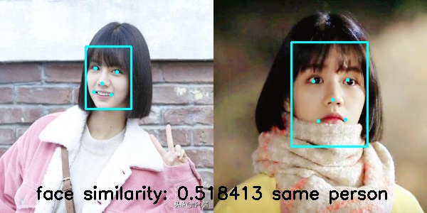
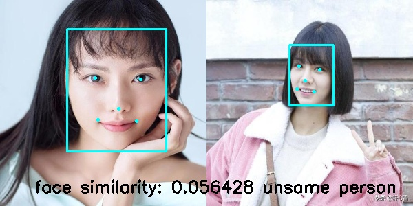

# face-recognition-ncnn
##  Network
face detection netword:**RetinaFace** [MobileNet0.25](https://github.com/deepinsight/insightface/issues/669)

face recognition:**mobilenet v2 faecnet** [mobilenet v2 faecnet](https://github.com/deepinsight/insightface/issues/214)

## Test

- for x86_64 linux  with no vulkan

```cmake
mkdir build
cd build
cmake ../
make -j4
./face_ncnn ../test_pic/2.jpg ../test_pic/4.jpg
```

- for jetson agx  
  交叉编译armv8版本的ncnn， 使用install/lib、install/include 替换本项目中的lib、include.  
  在jetson agx下执行：

```cmake
mkdir build
cd build
cmake -DCMAKE_TOOLCHAIN_FILE=../toolchains/jetson.toolchain.cmake ../
make -j4
./face_ncnn ../test_pic/2.jpg ../test_pic/4.jpg
```

- 测试图片放在test_pic

- 结果放在output_pic

  
  
  

- References

> https://github.com/Tencent/ncnn
>
> https://github.com/Charrin/RetinaFace-Cpp
>
> https://github.com/deepinsight/insightface

